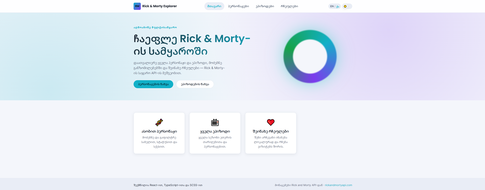
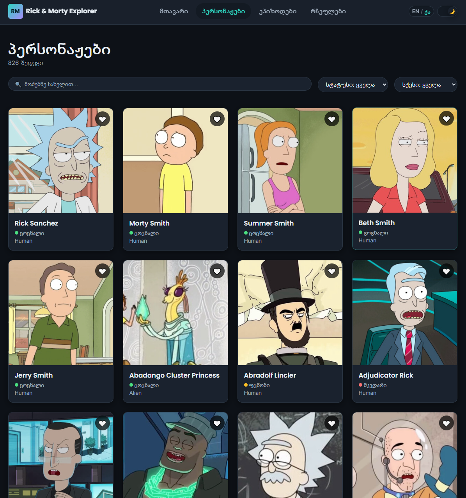
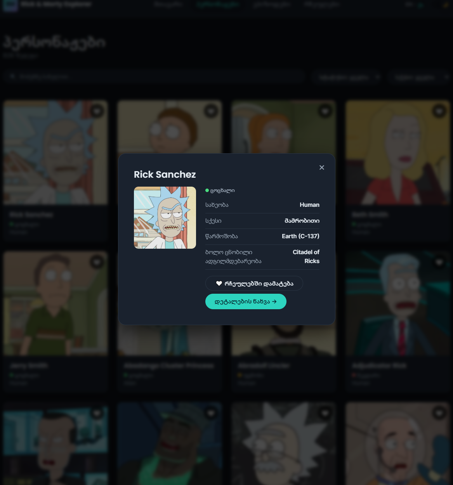
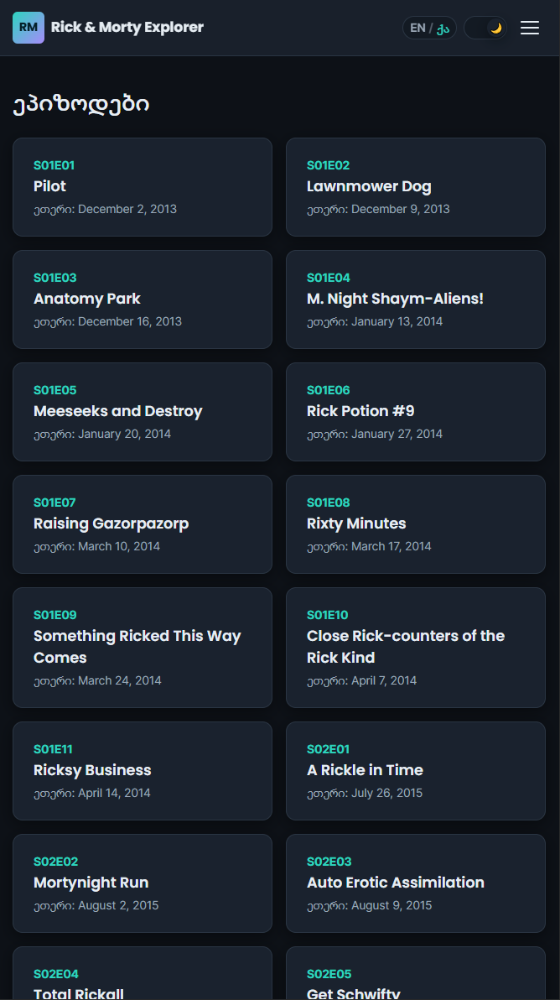

# Rick & Morty Explorer 🛸

რესპონსიული ერთგვერდიანი (SPA) ვებ-აპლიკაცია **Rick and Morty**-ის სამყაროს დასათვალიერებლად — მოძებნე და გაფილტრე ასობით პერსონაჟი, დაათვალიერე ყველა ეპიზოდი, ნახე პერსონაჟების დეტალური ინფორმაცია და შეინახე რჩეულები. შექმნილია React-ის საფინალო პროექტისთვის.

**🔗 ცოცხალი ვერსია (Live demo):** https://rainbow-douhua-b44f40.netlify.app/
**💻 სორს კოდი:** https://github.com/WikoCode/Rick-and-Morty-Explorer-

---

## ✨ ფუნქციონალი

| მოთხოვნა | რეალიზაცია |
| --- | --- |
| **5 გვერდი** (მინიმუმ 3 იყო საჭირო) | მთავარი · პერსონაჟები · პერსონაჟის დეტალები · ეპიზოდები · რჩეულები (+ 404 გვერდი) |
| **ფუნქციური კომპონენტები** | ყველა კომპონენტი ფუნქციურია — კლასობრივი კომპონენტები არ გამოყენებულა |
| **React Hooks** | `useState`, `useEffect`, `useContext`, `useCallback`, `useMemo` + ორი საკუთარი ჰუკი (`useDebounce`, `useLocalStorage`) |
| **React Router** | კლიენტის მხარის ნავიგაცია, მათ შორის დინამიური მისამართი `/character/:id` და 404-ისთვის wildcard მისამართი |
| **API ინტეგრაცია** | [Rick and Morty API](https://rickandmortyapi.com) მონაცემები მოტანილია **Axios**-ით |
| **მონაცემთა შენახვა (Storage)** | რჩეულები, თემა და ენა ინახება **localStorage**-ში |
| **რესპონსივი** | Mobile-first SCSS, შემოწმებულია Chrome DevTools-ის მოწყობილობების ჩამონათვალზე |
| **ანიმაციები / მოდალები** | **Framer Motion** ანიმაციები + მრავალჯერ გამოყენებადი მოდალური ფანჯარა (portal, Esc/ფონზე დაჭერით დახურვა, სქროლის დაბლოკვა) |
| **სუფთა სტრუქტურა** | ფუნქციებზე დაფუძნებული ფოლდერები, კომპონენტთან ერთად განთავსებული სტილები, ტიპიზებული API ფენა |

### 🎁 ბონუს ფუნქციონალი

- 🎨 **SCSS** პრეპროცესორი ცვლადებზე დაფუძნებული დიზაინ-სისტემით (`_variables`, `_mixins`, `_themes`)
- 🌗 **მუქი / ღია (Dark / Light) თემა** — ნაგულისხმევად მიჰყვება სისტემის პარამეტრს და ინახება
- 🌍 **ორენოვანი ინტერფეისი** — ქართული 🇬🇪 და ინგლისური 🇬🇧, გადართვადი რეალურ დროში
- 🧩 **Context API** თემის, ენისა და რჩეულების მდგომარეობის სამართავად
- 🔷 **TypeScript** მთელ პროექტში, სრულად ტიპიზებული
- 🔎 დაყოვნებული (debounced) ძიება, ფილტრები (სტატუსი + სქესი) და გვერდებად დაყოფა (pagination)

---

## 🛠️ გამოყენებული ტექნოლოგიები

- **React 19** + **TypeScript**
- **Vite** (აგების ხელსაწყო და dev სერვერი)
- **React Router** (ნავიგაცია)
- **Axios** (HTTP კლიენტი)
- **Framer Motion** (ანიმაციები)
- **Sass / SCSS** (სტილები)

---

## 🚀 გაშვების ინსტრუქცია

### წინაპირობა
- [Node.js](https://nodejs.org/) ვერსია 18+ და npm

### ინსტალაცია და გაშვება

```bash
# 1. დააინსტალირე დამოკიდებულებები
npm install

# 2. გაუშვი dev სერვერი (http://localhost:5173)
npm run dev

# 3. ააგე საპროდაქშენო ვერსია
npm run build

# 4. ლოკალურად ნახე საპროდაქშენო ვერსია
npm run preview
```

---

## 📁 პროექტის სტრუქტურა

```
src/
├── api/            # Axios ინსტანსი და ტიპიზებული API ფუნქციები
├── components/
│   ├── character/  # CharacterCard, CharacterQuickView
│   ├── layout/     # Navbar, Footer, Layout, ScrollToTop
│   └── ui/         # Modal, Loader, Pagination, SearchBar, გადამრთველები, ბეჯები
├── context/        # ThemeContext, LanguageContext, FavoritesContext
├── hooks/          # useDebounce, useLocalStorage
├── i18n/           # ინგლისური / ქართული თარგმანების ლექსიკონი
├── pages/          # Home, Characters, CharacterDetail, Episodes, Favorites, NotFound
├── styles/         # SCSS დიზაინ-სისტემა (variables, mixins, themes, global)
├── types/          # საერთო TypeScript ტიპები
├── App.tsx         # მისამართების (routes) აღწერა
└── main.tsx        # აპლიკაციის შესვლის წერტილი + context პროვაიდერები
```

---

## 📸 სქრინშოტები

> დაამატე საკუთარი სქრინშოტები `screenshots/` ფოლდერში და ჩასვი ქვემოთ.

| მთავარი (ღია თემა) | პერსონაჟები (მუქი თემა) |
| --- | --- |
|  |  |

| მოდალური ფანჯარა | მობილური ვერსია |
| --- | --- |
|  |  |

---

## 🌐 ჰოსტინგი

აპლიკაცია განთავსებულია Netlify-ზე:

**👉 https://rainbow-douhua-b44f40.netlify.app/**

---

## 📚 მადლობა

მონაცემები მოწოდებულია უფასო [Rick and Morty API](https://rickandmortyapi.com)-ის მიერ.
შექმნილია React-ით, TypeScript-ითა და SCSS-ით.
